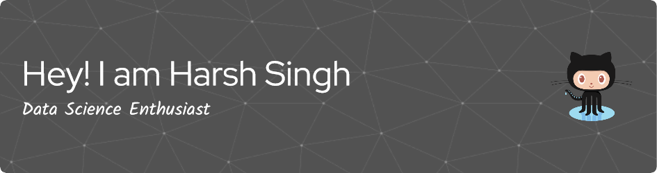

  

- 🌱 I’m currently learning **NLP**

- 👯 I’m looking to collaborate on **Chatbot Project**

- 👨‍💻 All of my projects are available at [https://sites.google.com/view/harshsinghprofile](https://sites.google.com/view/harshsinghprofile)

- 📫 How to reach me **harshpapratapsingh@gamil.com**

<h3 align="left">Connect with me:</h3>

<h3 align="left">Languages and Tools:</h3>

          

&nbsp;

